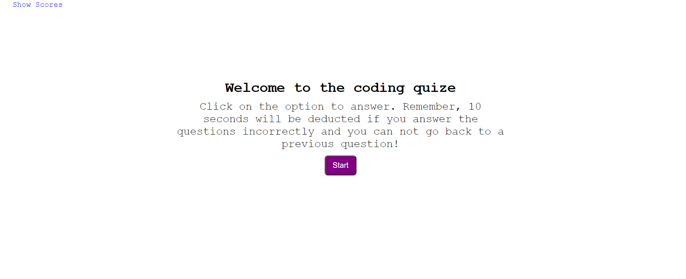
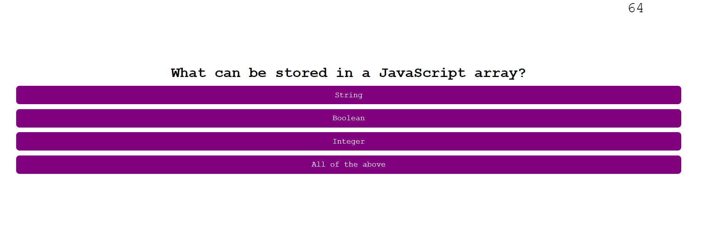
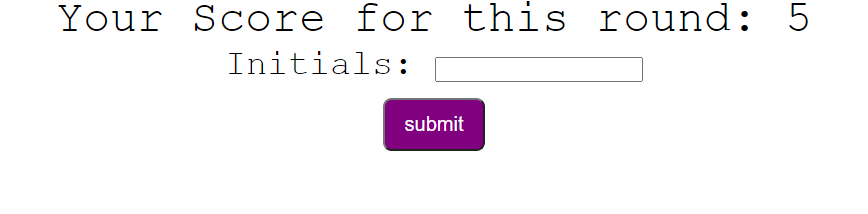

# Coding Quiz
Click [here](https://ancosta993.github.io/coding-quize/) for the project.

## Introduction
This is a Javascript Fundamental quiz made using HTML, CSS, and Javascript for the user.

## Function
- The application displays a start button, an introductory paragraph, and high score button.
- Clicking on the score button shows the scores associated with other users (or the users themselves).
- User click on the button starts the quize.
- This application gives a timed quize to a user with multiple choice questions.
- Questions are displayed one per page. 
- The user can select an answer by clicking on the answer choices.
- The application validates the answer. 
- The application takes 10 seconds off the timer if the answer is incorrect and increases the score by 1 if the answer is correct.
- After the time runs out, or the user finishes all the questions, the total score is displayed. 
- The user is then given the option to enter their initials in an input field.
- If the user enters an initial, their score is saved.
- The application goes back to its initial page after the quiz finishes.

## Site structure
- Starting page.
  - It displays a pargraph, submit button, and score list button.
- Question page.
  - Display the question title and all four choices. It also displays the timer.
  - Once a choice is cliked, the page replaces the current question and set of answer choice with the next question. The evaluation of the previous question is displayed at the bottom 
- Final page
  - Shows the final score and gives an input field for initials

## Logic (PseudoCode)

### Timer
- The program defines the `timeCounter` function for handling time.
- It uses two global variables: `intervalID` and `time`.
- The function is called through the `setInterval` function every 1000 ms. The returned value is refrenced by the `intervalId` variable declared earlier.
- Once called, it subtracts 1 from the current value of `time` and checks if the it is negative.
- If it is negative, then it stops the time with `clearInterval` and handles the end game functions.

### Questions as Objects
- The program makes every questions an object:
- ` {
      title:"What can be stored in a JavaScript array?",
      option1:"String",
      option2:"Boolean",
      option3:"Integer",
      option4:"All of the above",
      correctChoice: "All of the above"
   }`
   - Above is an example of a question object and its proeprties. All the question objects are store in an array called `questionObjArr`.
   - The program uses the index of this array to identify different question. The index increases by 1 as the user answers a question. The increase in index causes the `displayQuestions` function to display the next question in the list.

### Displaying the questions
- Handled by the `displayQuestion` function. It sets the `display` property for the list elements `li` to `block`. So, it displays all the list elements already in the DOM. The `li`s are used for listing the answer choices. They are wrapped by `ul` element in the DOM.
- Global Variable used: `counter` and other necessary HTML elements.
- Starts by removing the intro paragraph, submit button, and get score button.
- Uses the `counter` global variable as an index to iterate over the `questionObjArr` array. It sets each of the `li` text content to value of `option` property.
- Sets the style for the answer options.

### Evaluating the User Answer
- adds event handler to the outer wrapper of the answer options. A click on it will use the `event.target.matches('.options')` to determine whether it is a click on an answer options. (They have the `class='options'`). Uses the the `evaluate` function.
- with conditionals, checks if the selected answer text content matches that of the current quesion objects `correctChoice` property value:
-If `true`:
  - displays "correct"
  - adds 1 to the score
- else:
  - displays "wrong:
  - subtracts 10 from `time`
- Then, increases counter by 1 to display the next question in the `questionObjArr` using the `displayQuestion` function (see above).
- After that, uses conditionals to check if `counter` value is higher than the length of the questionObjArr:
- If `true`:
  - calls the `displayQuestion` function with the `counter` variable.
- else:
  - calls the end game functions.
  
### The End game functions
Uses the three functions:
- `clearInterval`
- `showScore`
- `createFormInitial`
- `clearInterval` stops the timer.
- `showScore
  - removes all the options, titles, and evaluation message.
  - creates a new `div` and displays the score through it.
- `createFormInitial`
  - creates `form` elements for users.
  - takes the text input from them.
  - creates a `button` for submiting the input.
  - upon submission, calls the `storeScore` function.
- `storeScore` function
  - makes a `tempScoreObj` object
  - detects a click in the submit button for inputs.
  - sets the property of the obj:
  - `{initials: 'AB', score: '2'}` as an example
  - if the input field is empty, no initials and score is saved.

## Finished Look

